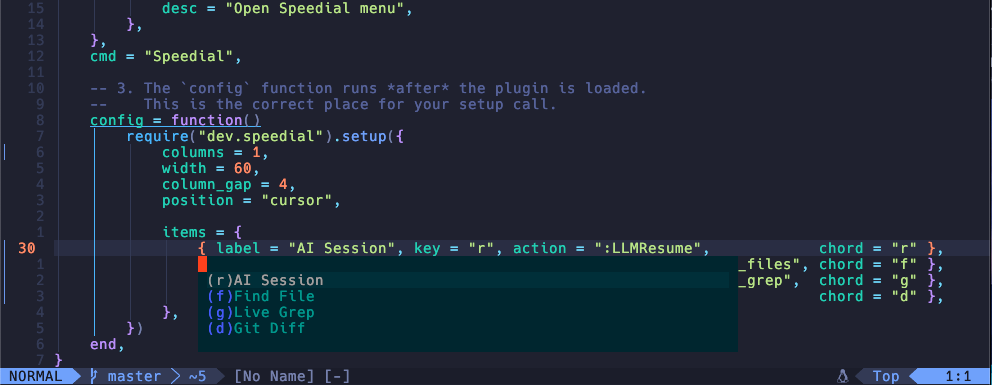
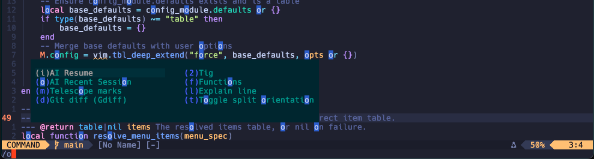

# Speedial.nvim

A lightweight and customizable speed-dial menu plugin for Neovim (Lua).  
Quickly access your favorite actions, commands, or functions with a clean, minimal interface.
Comes with a built-in default menu for an instant start.

---

## ✨ Features

- **Floating Menu**: Opens near the cursor or centered on screen.
- **Multi-column Layout**: Configurable grid layout with gap control.
- **Hotkey Highlighting**: Visual emphasis on configured key letters.
- **Chord Support**: Trigger items using custom key chords.
- **Named Menus**: Define and switch between multiple sets of actions.
- **External Menu Files**: Define menus in separate `.lua` files for organization.
- **Built-in Default Menu**: Works immediately with common Telescope commands.
- **Selection Navigation**: Move with arrow keys and confirm with `<CR>`.
- **Automatic Cleanup**: Closes on window leave or escape.
- **Customizable UI**: Define highlight groups and appearance.

---



## 🔧 Installation

Using [lazy.nvim](https://github.com/folke/lazy.nvim):

```lua
return {
    "lecheel/speedial",
    lazy = true,
    -- Basic setup with default menu on <F12>
    keys = {
        {
            "<F12>",
            function()
                require("speedial").open() -- Opens the built-in default menu
            end,
            desc = "Open Speedial menu (default)",
        },
    },
    opts = {
        -- Customize the default appearance (optional)
        position = "cursor", -- or "center"
        width = 70,
        columns = 2,
        column_gap = 4,
        border = "none", -- or "single", "rounded", etc.
        -- Highlight groups are defined automatically but can be customized
        -- bg_hl = "SpeedialNormal",
        -- border_hl = "SpeedialBorder",
        -- key_hl = "SpeedialKey",
        -- chord_hl = "SpeedialChord",
        -- selected_hl = "SpeedialSelected",
    },
    -- If you want to configure named menus or override defaults during setup:
    -- config = function(_, opts)
    --   require("speedial").setup(vim.tbl_extend("force", opts, {
    --       menus = {
    --           -- Override the default menu
    --           default = {
    --               { label = "Custom Item", key = "c", action = ":echo 'Hi!'", chord = "ci" },
    --           },
    --           -- Define other named menus
    --           llm = {
    --               { label = "New Chat", key = "n", action = ":LLMNew", chord = "nc" },
    --               { label = "Resume", key = "r", action = ":LLMResume", chord = "rs" },
    --           },
    --           -- Or point to external Lua files (e.g., ~/.config/nvim/lua/my_menus/git.lua)
    --           -- git = "my_menus.git",
    --       }
    --   }))
    -- end
}
```

---

## 🚀 Usage

### Open the Menu

- **Default Menu**: The plugin provides a built-in menu with common actions (Telescope find, grep, buffers, help). Press `<F12>` (as configured above) or run `:lua require('speedial').open()` to use it immediately.
- **Named Menus**: Open a specific named menu: `:lua require('speedial').open('menu_name')`.
- **External Module Menu**: Open a menu defined in a Lua file directly: `:lua require('speedial').open('module.name')` (e.g., if you have `~/.config/nvim/lua/my_menus/custom.lua`, use `require('speedial').open('my_menus.custom')`).

### Keymaps within the Menu

- `<Esc>`: Close the menu.
- `<CR>`: Execute the selected item.
- Arrow Keys (`<Up>`, `<Down>`, `<Left>`, `<Right>`): Navigate items.
- Item Chord (e.g., `f`): Execute that specific item directly.

---

## ⚙️ Configuration Options

Configuration is done via the `opts` table in lazy.nvim or by calling `require("speedial").setup({ ... })`.

| Option         | Default       | Description |
|----------------|---------------|-------------|
| `position`     | `"cursor"`    | Where to place the popup: `"cursor"` or `"center"` |
| `border`       | `"none"`      | Border style (`"single"`, `"double"`, `"rounded"`, etc.) |
| `width`        | `60`          | Total width of the floating window |
| `columns`      | `2`           | Number of columns in the grid |
| `column_gap`   | `4`           | Space between columns |
| `menus`        | `{}`          | Table defining named menus (see below). |

> Use `require("speedial").setup({ ... })` to override defaults, define menus, or set highlight groups.

### Defining Named Menus

The `menus` option allows you to define multiple sets of items:

```lua
-- In your lazy.nvim plugin spec config function, or a separate setup call:
require("speedial").setup({
    -- ... other options ...
    menus = {
        -- The 'default' menu (used by require("speedial").open())
        default = {
            { label = "Find File", key = "f", action = ":Telescope find_files", chord = "f" },
            { label = "Live Grep", key = "g", action = ":Telescope live_grep", chord = "g" },
        },
        -- A custom named menu
        llm = {
            { label = "New Chat", key = "n", action = ":LLMNew", chord = "n" },
            { label = "Resume", key = "r", action = ":LLMResume", chord = "r" },
        },
    }
})
```

To open these:
- `require("speedial").open()` --> Opens the `default` menu.
- `require("speedial").open("llm")` --> Opens the `llm` menu.

---

## 🗂️ Item Structure

Each item in a menu is a table:

```lua
{
    label = "Visible Text",       -- Required
    key = "k",                    -- Optional: letter to highlight
    chord = "k",                  -- Optional: direct keybinding
    action = "command" | function() ... end, -- What to run when selected
}
```

Example:
```lua
{
    label = "New File",
    key = "N",
    chord = "n",
    action = function()
        vim.cmd("enew")
    end
}
```

---

## 🔄 Behavior

- Press `<Esc>` or click outside to close.
- Navigate with arrow keys (`<Up>`, `<Down>`, `<Left>`, `<Right>`).
- Confirm selection with `<CR>`.
- Any registered `chord` acts as a direct trigger for its item.
- If the menu is already open, calling `open()` again closes it (toggle behavior).

---

## 📄 License

MIT — See `LICENSE` file.
